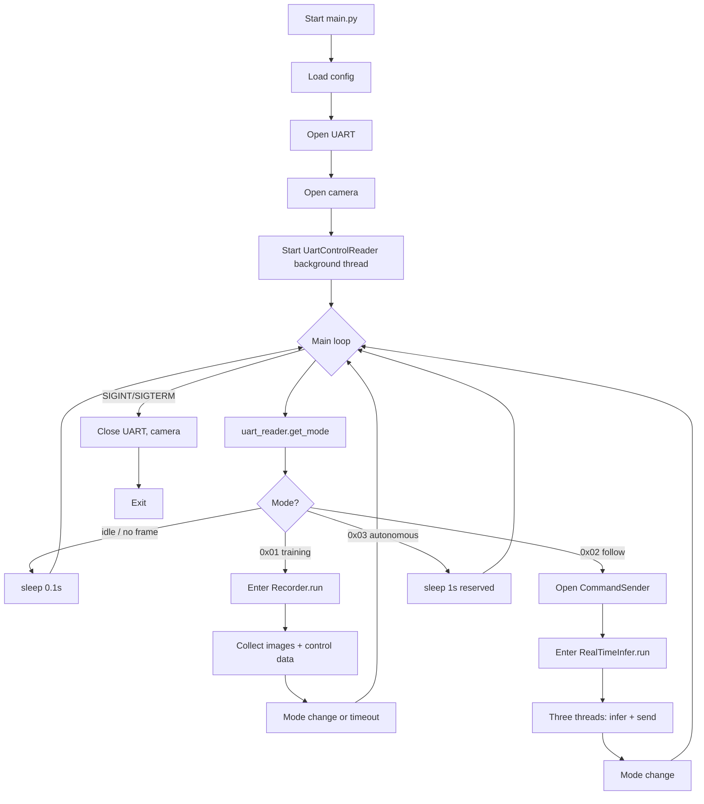
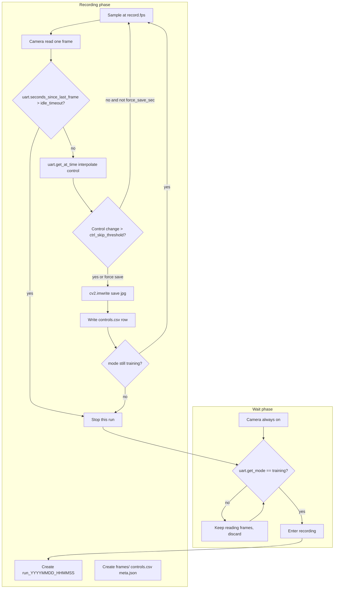
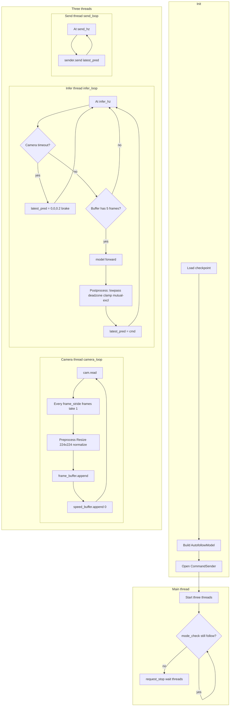
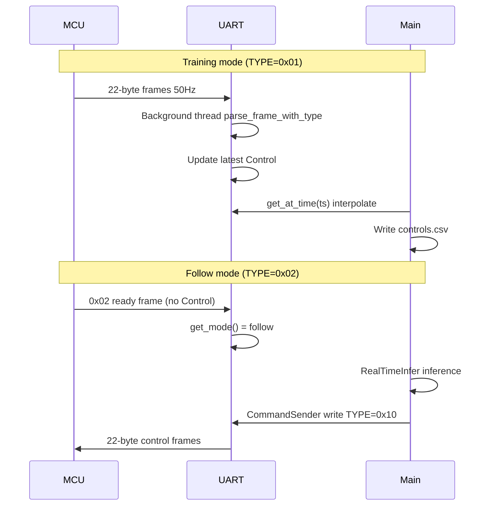
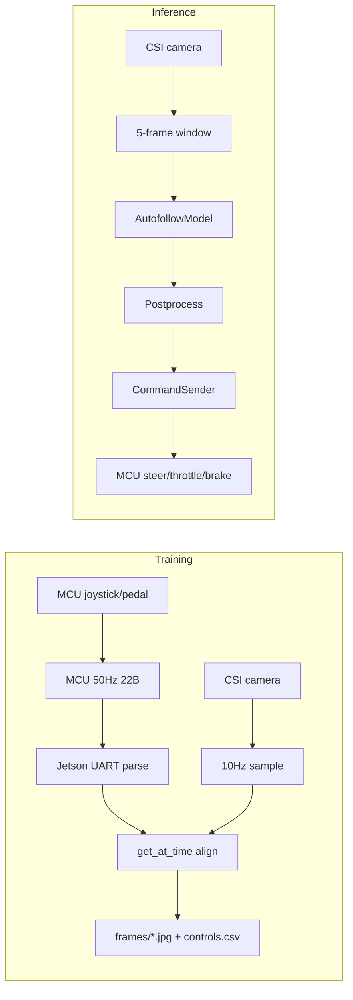

# Autodrive — DlaCart Autonomous Driving Training & Inference

> End-to-end imitation learning system for the DlaCart RC car: collect driving data, train control models, and run real-time inference on Jetson to send control commands to the MCU. The host switches between training and follow modes according to the MCU frame TYPE.

**Author: DaliangAuto**

Chinese documentation: **README_CN.md**

---

## Table of Contents

- [1. Project Overview](#1-project-overview)
- [2. System Architecture](#2-system-architecture)
- [3. Flow Description](#3-flow-description)
- [4. Directory Structure](#4-directory-structure)
- [5. Environment & Dependencies](#5-environment--dependencies)
- [6. How to Run](#6-how-to-run)
- [7. Configuration](#7-configuration)
- [8. Modes & Protocol](#8-modes--protocol)
- [9. Module Reference](#9-module-reference)
- [10. Data Format](#10-data-format)
- [11. Model & Inference](#11-model--inference)
- [12. FAQ](#12-faq)

---

## 1. Project Overview

### 1.1 Features

| Feature | Description |
|--------|-------------|
| **Data collection** | In MCU training mode, Jetson receives driving data via UART and aligns it with camera frames for storage |
| **Real-time inference** | In MCU follow mode, Jetson runs a neural network to predict steer/throttle/brake and sends commands to the MCU |
| **Unified entrypoint** | Single process runs in background; switches between training/follow based on MCU frame TYPE |

### 1.2 Tech Stack

| Item | Description |
|------|-------------|
| **Host** | Jetson Orin Nano, Python 3.8+ |
| **Camera** | CSI camera, GStreamer capture |
| **Communication** | USART, 115200 baud, 22-byte binary frames, CRC16-MODBUS |
| **Model** | PyTorch, ResNet18 + GRU; input 5 frames + 5 speeds, output steer/throttle/brake |

### 1.3 Typical Flow

```
1. Start main.py on boot
2. Wait for MCU UART data
3. On TYPE=0x01 → enter training mode, collect images + control data to data/raw/
4. On TYPE=0x02 → enter follow mode, load model, run inference and send control commands to MCU
5. Mode changes are selected on the HMI; MCU reports the corresponding TYPE
```

---

## 2. System Architecture

```
┌─────────────────────────────────────────────────────────────────┐
│                        Jetson Orin Nano                          │
│  ┌──────────┐  ┌──────────┐  ┌──────────┐  ┌──────────────────┐ │
│  │ main.py  │  │  Camera  │  │  UART    │  │  models/         │ │
│  │  entry   │  │  CSI     │  │  TX/RX   │  │  AutofollowModel │ │
│  └────┬─────┘  └────┬─────┘  └────┬─────┘  └────────┬─────────┘ │
│       │             │             │                  │           │
│       ├─────────────┴─────────────┴──────────────────┘           │
│       │  mode=training → record_data  save frames+controls.csv    │
│       │  mode=follow   → inference   inference + CommandSender   │
└───────┼─────────────────────────────────────────────────────────┘
        │ USART1 115200
        ▼
┌───────────────────┐
│   DlaCart MCU     │
│   (STM32F103)     │
│  Training: 50Hz   │
│  Follow: receive  │
└───────────────────┘
```

---

## 3. Flow Description

### 3.1 Overall Flow (main.py unified entrypoint)



### 3.2 Training Mode Flow (Recorder)



**Training mode notes**:

| Step | Description |
|------|-------------|
| Wait | Main loop polls `get_mode()`; only when `training` does it enter Recorder |
| Timeout exit | `seconds_since_last_frame > idle_timeout_sec` (default 3s) stops this run |
| Control dedup | If steer/throttle/brake change &lt; `ctrl_skip_threshold`, no new row unless elapsed &gt; `force_save_sec` |
| Interpolation | `get_at_time(frame_ts)` interpolates in time so every frame has a control value |

### 3.3 Follow Mode Flow (RealTimeInfer)



**Follow mode notes**:

| Step | Description |
|------|-------------|
| Camera thread | 30 fps read; every `frame_stride` (default 3) frames take 1 → ~10 Hz, aligned with training |
| Speed | In follow mode MCU does not send telemetry; `speed_buffer` is filled with 0 |
| Infer thread | 10 Hz inference; when 5-frame window is full call model; output goes through lowpass, deadzone, clamp; throttle set to 0 when brake &gt; 0.05 |
| Send thread | 20 Hz send to meet MCU receive rate |
| Camera timeout | When `now - last_camera_ok_ts > max_idle_sec` output (0, 0, 0.2) for brake |

### 3.4 UART Data Flow



### 3.5 Data Flow Overview



---

## 4. Directory Structure

```
Autodrive/
├── main.py                 # Unified entrypoint: switch by MCU frame TYPE
├── run_autodrive.sh        # Start unified entrypoint
├── run_record.sh           # Standalone recording
├── run_infer.sh            # Standalone inference
│
├── config/
│   ├── autodrive.yaml      # Unified config (training + inference)
│   ├── record.yaml         # Recording-only config
│   └── infer.yaml          # Inference-only config
│
├── src/
│   ├── camera.py           # CSI camera (GStreamer)
│   ├── uart_control.py     # UART protocol parse, frame TYPE
│   ├── record_data.py      # Training data collection
│   └── inference.py        # Real-time inference + command send
│
├── models/
│   ├── __init__.py
│   ├── autofollow.py       # AutofollowModel definition
│   └── best_model_*.pth    # Trained weights (example)
│
├── utils/
│   └── __init__.py         # IMAGENET_MEAN, IMAGENET_STD
│
├── data/
│   ├── raw/                # Raw collection data
│   │   └── run_YYYYMMDD_HHMMSS/
│   │       ├── frames/     # 000000.jpg, 000001.jpg, ...
│   │       ├── controls.csv
│   │       └── meta.json
│   └── processed/          # Processed data (training)
│
├── TRAINING_PROTOCOL.md    # MCU training-mode UART protocol
├── MCU_DOCUMENTATION.md    # MCU control program description
├── TRAINING_README.md      # Training / model / inference spec
└── README.md               # This file
```

---

## 5. Environment & Dependencies

### 5.1 Python Dependencies

```bash
pip install torch torchvision pandas Pillow numpy tqdm PyYAML pyserial opencv-python
```

Or use `requirements.txt` if present:

```
torch>=2.0
torchvision>=0.15
pandas>=1.0
Pillow>=9.0
numpy>=1.20
tqdm>=4.60
PyYAML
pyserial
opencv-python
```

### 5.2 Hardware & Environment

- **Jetson Orin Nano** (or compatible Jetson)
- **CSI camera** (e.g. IMX219, GStreamer support)
- **UART**: MCU via CH341 or similar USB-serial; device usually `/dev/ttyCH341USB0` or `/dev/ttyUSB0`
- **CUDA** (optional, for inference acceleration)

### 5.3 UART Device

Check that the port exists:

```bash
ls /dev/ttyCH341* /dev/ttyUSB*
```

If not, check USB connection and drivers.

---

## 6. How to Run

### 6.1 Unified Entrypoint (recommended, for boot auto-start)

Auto-switch training/follow by MCU mode:

```bash
cd /home/tdl/Autodrive
python3 main.py --config config/autodrive.yaml
# or
./run_autodrive.sh
```

**Prerequisite**: MCU connected, UART available. On the HMI select “Training” or “Follow”; Jetson switches based on received frame TYPE.

### 6.2 Recording Only (training mode)

Collect only, no inference:

```bash
python3 -m src.record_data --config config/record.yaml
# or
./run_record.sh
```

**Flow**: Wait for MCU to send TYPE=0x01 training frames → start saving images and controls.csv.

### 6.3 Inference Only (follow mode)

Inference only, no recording:

```bash
python3 -m src.inference --config config/infer.yaml
# or
./run_infer.sh
```

**Prerequisite**: Camera and UART available, model file present. **Note**: If MCU is not connected, UART open may fail; that is expected.

### 6.4 Stop

`Ctrl+C` or `SIGTERM` exits cleanly and closes camera and UART.

---

## 7. Configuration

### 7.1 config/autodrive.yaml (unified entrypoint)

```yaml
camera:
  sensor_id: 0
  width: 640
  height: 360
  fps: 30
  flip_method: 2        # 0=none 2=rotate 180°
  capture_width: 1920
  capture_height: 1080

uart:
  port: /dev/ttyCH341USB0
  baudrate: 115200
  timeout: 0.05
  max_steer_deg: 37.0   # Steering normalization ±37°

record:                 # Training mode
  fps: 10
  jpg_quality: 90
  idle_timeout_sec: 3.0
  ctrl_skip_threshold: 0.02
  force_save_sec: 1.0

output:
  root: data/raw

infer:                  # Follow mode
  device: cuda
  ckpt: models/best_model_030923_17.pth
  infer_hz: 10.0
  send_hz: 20.0
  frame_stride: 3
  max_idle_sec: 1.0

postprocess:
  steer_alpha: 0.3
  throttle_alpha: 0.2
  brake_alpha: 0.2
  steer_deadband: 0.03
  brake_deadband: 0.05
  max_abs_steer: 0.6
  max_throttle: 0.30
  max_brake: 0.30
```

### 7.2 Key Parameters

| Parameter | Description |
|-----------|-------------|
| `uart.port` | UART device path; must match MCU connection |
| `infer.ckpt` | Path to inference checkpoint |
| `infer.device` | `cuda` or `cpu` |
| `frame_stride` | At 30 fps camera, take 1 every 3 frames → ~10 Hz, aligned with training |

---

## 8. Modes & Protocol

### 8.1 Frame TYPE and Mode

| MCU sends TYPE | Mode | Jetson behavior |
|----------------|------|-----------------|
| **0x01** | Training | Collect images + control data, save to data/raw/ |
| **0x02** | Follow | Start inference, send TYPE=0x10 control frames to MCU |
| **0x03** | Autonomous (reserved) | Not handled yet |

### 8.2 22-Byte Frame Format (MCU ↔ Jetson)

| Offset | Length | Field | Description |
|--------|--------|-------|-------------|
| 0-1 | 2 | SOF | 0xAA 0x55 |
| 2 | 1 | VER | 0x01 |
| 3 | 1 | TYPE | 0x01 training / 0x02 follow ready / 0x10 Host control |
| 4-5 | 2 | SEQ | Sequence number |
| 6-9 | 4 | TS_MS | Timestamp ms |
| 10-11 | 2 | SPD_MEAS | Speed 0.1 km/h |
| 12-13 | 2 | STEER | Steering 0.1°, left negative |
| 14-15 | 2 | THR_REF | Pedal 0~1000 |
| 16 | 1 | BRAKE | 0/1 |
| 17 | 1 | GEAR | 0=P 1=R 2=N 3=D |
| 18-19 | 2 | FLAGS/RES | Reserved |
| 20-21 | 2 | CRC16 | CRC16-MODBUS |

**Normalization** (Jetson parses MCU): Done on Jetson; MCU sends raw units.  
- steer: `steer_01 / (37.0 * 10)` → [-1, 1]  
- throttle: `thr_ref / 1000` → [0, 1]

**Denormalization** (Jetson → MCU): Inference output is [-1,1]/[0,1]; convert back to protocol units before send.

---

## 9. Module Reference

### 9.1 main.py

- Opens camera and UART
- Background thread parses UART frames and maintains `get_mode()`
- Main loop: when `mode==training` call `Recorder`, when `mode==follow` call `RealTimeInfer`
- On mode change, stops current task and switches

### 9.2 src/camera.py

- GStreamer pipeline for CSI camera
- Supports `sensor_id`, resolution, fps, `flip_method`
- API: `open()`, `read()`, `close()`

### 9.3 src/uart_control.py

- Parses 22-byte frames, CRC check
- `parse_frame_with_type()`: returns `(TYPE, Control|None)`
- `UartControlReader`: background UART read, maintains `latest()`, `get_at_time()`, `get_mode()`
- `get_mode()`: returns `"training"` / `"follow"` / `"autonomous"` / `"idle"` from last received TYPE

### 9.4 src/record_data.py

- `Recorder`: idle → recording → idle
- Waits for TYPE=0x01 or `has_received_frame()`
- Samples at `record.fps`, writes `frames/*.jpg` and `controls.csv`
- Supports `ctrl_skip_threshold`, `force_save_sec`, etc.

### 9.5 src/inference.py

- `CommandSender`: packs TYPE=0x10 control frames and sends
- `RealTimeInfer`: camera loop, infer loop, send loop (multi-threaded)
- Input: 5 frames + 5 speeds (follow mode fills 0 when no MCU speed)
- Output: steer / throttle / brake, sent after lowpass, deadzone, clamp

---

## 10. Data Format

### 10.1 Collection Directory

```
data/raw/run_YYYYMMDD_HHMMSS/
├── frames/
│   ├── 000000.jpg
│   ├── 000001.jpg
│   └── ...
├── controls.csv
└── meta.json
```

### 10.2 controls.csv Fields

| Field | Description |
|-------|-------------|
| frame_idx | Frame index |
| frame_ts | Frame timestamp |
| image_path | Image path relative to run, e.g. frames/000123.jpg |
| ts | Control timestamp |
| steer | Steering [-1, 1] |
| throttle | Throttle [0, 1] |
| brake | Brake [0, 1] |
| gear | Gear (not used in training) |
| speed | Speed km/h |
| seq, ts_ms, raw | Raw protocol fields |

### 10.3 Training Data Rules

- Each run directory is one session; do not form samples across sessions
- Only use 5-frame windows with strictly increasing `frame_idx`
- Labels are the last frame’s steer, throttle, brake

---

## 11. Model & Inference

### 11.1 Model Structure (AutofollowModel)

```
Input: images [B, 5, 3, 224, 224], speeds [B, 5, 1]
  → ResNet18 per-frame features 512-dim
  → Speed MLP (1→16→16)
  → concat [B, 5, 528] → GRU(256)
  → last hidden → MLP
Output: [B, 3]  (steer, throttle, brake)
```

### 11.2 Inference Spec

| Item | Requirement |
|------|-------------|
| Images | 5 frames [t-4..t], RGB, Resize 224×224, ImageNet normalization |
| Speed | 5 values one per frame, km/h; follow mode uses 0 when no MCU |
| Output | steer [-1,1], throttle [0,1], brake [0,1] |

### 11.3 Checkpoint

- Default path: `models/best_model_030923_17.pth` (configurable)
- Structure: `{"epoch", "model_state_dict", "val_loss", "optimizer_state_dict"}`
- Inference uses only `model_state_dict`

### 11.4 Postprocessing

- Lowpass: `steer_alpha`, `throttle_alpha`, `brake_alpha`
- Deadzone: `steer_deadband`, `brake_deadband`
- Clamp: `max_abs_steer`, `max_throttle`, `max_brake`
- Mutual exclusion: when brake &gt; 0.05, throttle set to 0

---

## Reference Docs

- **TRAINING_PROTOCOL.md**: MCU training-mode UART protocol details
- **MCU_DOCUMENTATION.md**: MCU control program, hardware, modes
- **TRAINING_README.md**: Training flow, model structure, inference spec and API
