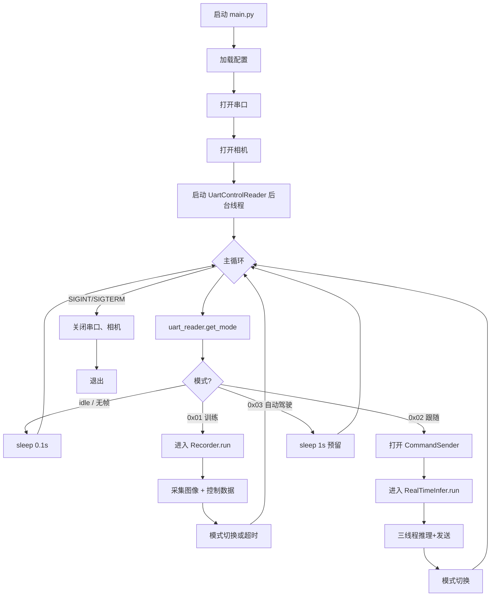
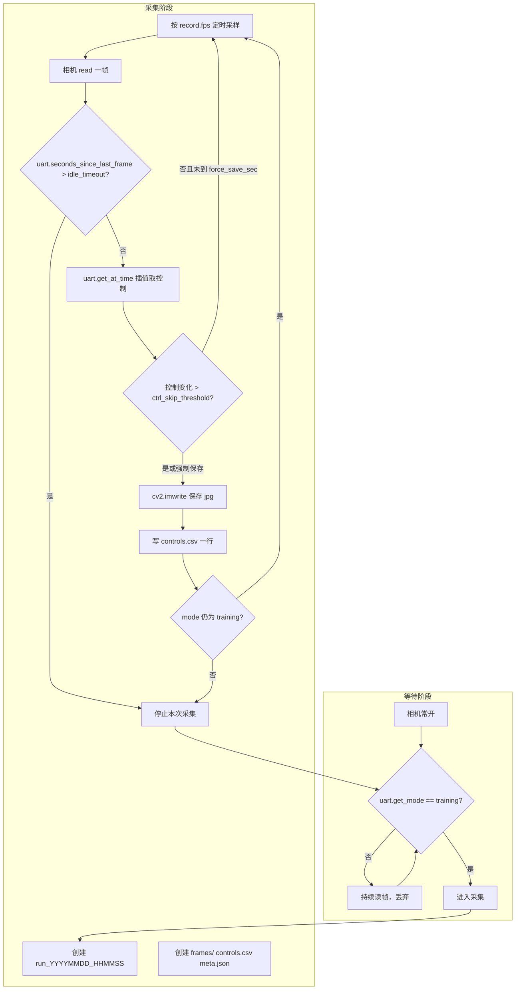
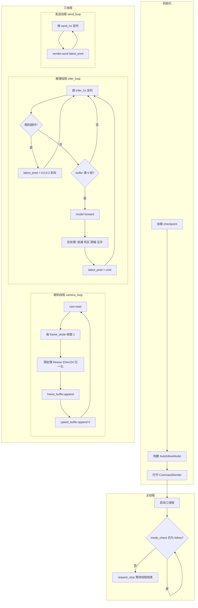
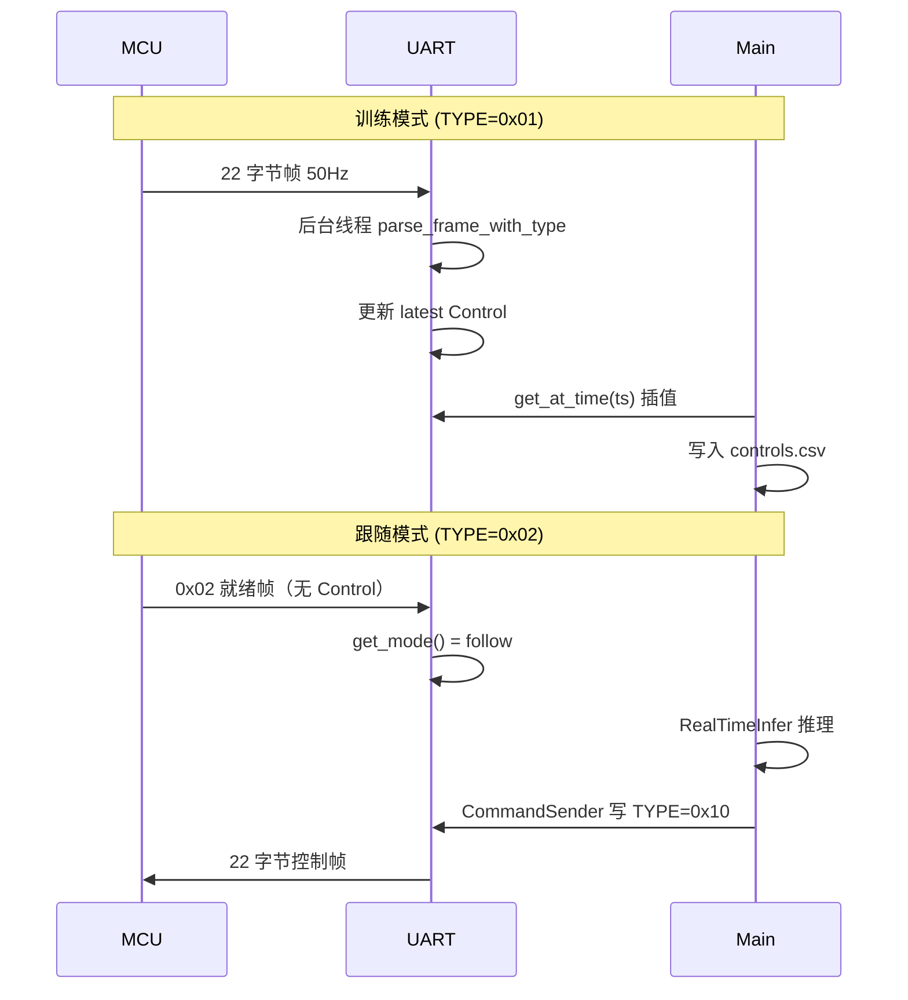
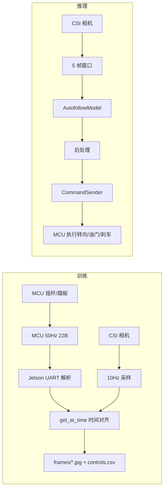

# Autodrive — DlaCart 自动驾驶训练与推理项目

> 面向 DlaCart 遥控小车的端到端模仿学习系统：采集驾驶数据、训练控制模型、Jetson 实时推理并下发控制指令。根据 MCU 串口帧 TYPE 自动切换训练/跟随模式。

---

## 目录

- [1. 项目概述](#1-项目概述)
- [2. 系统架构](#2-系统架构)
- [3. 流程说明](#3-流程说明)
- [4. 目录结构](#4-目录结构)
- [5. 环境与依赖](#5-环境与依赖)
- [6. 运行方式](#6-运行方式)
- [7. 配置说明](#7-配置说明)
- [8. 模式与协议](#8-模式与协议)
- [9. 模块说明](#9-模块说明)
- [10. 数据格式](#10-数据格式)
- [11. 模型与推理](#11-模型与推理)
- [12. 常见问题](#12-常见问题)

---

## 1. 项目概述

### 1.1 功能

| 功能 | 说明 |
|------|------|
| **数据采集** | MCU 训练模式下，Jetson 通过串口接收驾驶数据，与摄像头帧对齐并保存 |
| **实时推理** | MCU 跟随模式下，Jetson 运行神经网络，预测 steer/throttle/brake 并下发至 MCU |
| **统一入口** | 单进程后台运行，根据 MCU 发来的帧 TYPE 自动切换训练/跟随模式 |

### 1.2 技术栈

| 项目 | 说明 |
|------|------|
| **上位机** | Jetson Orin Nano，Python 3.8+ |
| **相机** | CSI 摄像头，GStreamer 采集 |
| **通信** | USART，115200，22 字节二进制帧，CRC16-MODBUS |
| **模型** | PyTorch，ResNet18 + GRU，输入 5 帧图像 + 5 个速度，输出 steer/throttle/brake |

### 1.3 典型流程

```
1. 开机运行 main.py
2. 等待 MCU 串口数据
3. 收到 TYPE=0x01 → 进入训练模式，采集图像+控制数据到 data/raw/
4. 收到 TYPE=0x02 → 进入跟随模式，加载模型，实时推理并发送控制指令给 MCU
5. 模式切换由串口屏选择，MCU 上报对应 TYPE
```

---

## 2. 系统架构

```
┌─────────────────────────────────────────────────────────────────┐
│                        Jetson Orin Nano                          │
│  ┌──────────┐  ┌──────────┐  ┌──────────┐  ┌──────────────────┐ │
│  │ main.py  │  │  Camera  │  │  UART    │  │  models/         │ │
│  │ 统一入口 │  │  CSI     │  │ 串口收发 │  │  AutofollowModel │ │
│  └────┬─────┘  └────┬─────┘  └────┬─────┘  └────────┬─────────┘ │
│       │             │             │                  │           │
│       ├─────────────┴─────────────┴──────────────────┘           │
│       │  mode=training → record_data  保存帧+controls.csv         │
│       │  mode=follow   → inference    推理 + CommandSender        │
└───────┼─────────────────────────────────────────────────────────┘
        │ USART1 115200
        ▼
┌───────────────────┐
│   DlaCart MCU     │
│  (STM32F103)      │
│  训练: 50Hz 上报  │
│  跟随: 接收指令   │
└───────────────────┘
```

---

## 3. 流程说明

### 3.1 整体流程（main.py 统一入口）



### 3.2 训练模式流程（Recorder）



**训练模式要点**：

| 步骤 | 说明 |
|------|------|
| 等待 | 主循环轮询 `get_mode()`，只有 `training` 才进入 Recorder |
| 超时退出 | `seconds_since_last_frame > idle_timeout_sec`（默认 3s）停止本次采集 |
| 控制去重 | `steer/throttle/brake` 变化 < `ctrl_skip_threshold` 不写新行，除非距上次保存 > `force_save_sec` |
| 插值 | `get_at_time(frame_ts)` 按时间插值，保证每帧都有对应控制量 |

### 3.3 跟随模式流程（RealTimeInfer）



**跟随模式要点**：

| 步骤 | 说明 |
|------|------|
| 相机线程 | 30fps 读帧，每 `frame_stride`（默认 3）帧取 1，得到约 10Hz 输入，与训练一致 |
| 速度 | 跟随模式 MCU 不发遥测，`speed_buffer` 填 0 |
| 推理线程 | 10Hz 推理，5 帧窗口满后调用模型，输出经低通、死区、限幅、brake>0.05 时 throttle 置 0 |
| 发送线程 | 20Hz 发送，保证 MCU 接收频率 |
| 相机超时 | `now - last_camera_ok_ts > max_idle_sec` 时输出 (0, 0, 0.2) 表示刹车 |

### 3.4 串口数据流



### 3.5 数据流总览



---

## 4. 目录结构

```
Autodrive/
├── main.py                 # 统一入口：根据 MCU 帧 TYPE 切换模式
├── run_autodrive.sh        # 启动统一入口
├── run_record.sh           # 单独运行采集
├── run_infer.sh            # 单独运行推理
│
├── config/
│   ├── autodrive.yaml      # 统一入口配置（训练+推理）
│   ├── record.yaml         # 采集专用配置
│   └── infer.yaml          # 推理专用配置
│
├── src/
│   ├── camera.py           # CSI 相机（GStreamer）
│   ├── uart_control.py     # 串口协议解析，帧 TYPE 识别
│   ├── record_data.py      # 训练数据采集
│   └── inference.py        # 实时推理 + 控制指令发送
│
├── models/
│   ├── __init__.py
│   ├── autofollow.py       # AutofollowModel 定义
│   └── best_model_030923_17.pth   # 训练好的权重（示例）
│
├── utils/
│   └── __init__.py         # IMAGENET_MEAN, IMAGENET_STD
│
├── data/
│   ├── raw/                # 原始采集数据
│   │   └── run_YYYYMMDD_HHMMSS/
│   │       ├── frames/     # 000000.jpg, 000001.jpg, ...
│   │       ├── controls.csv
│   │       └── meta.json
│   └── processed/          # 预处理后数据（训练用）
│
├── TRAINING_PROTOCOL.md    # MCU 训练模式串口协议
├── MCU_DOCUMENTATION.md    # MCU 控制程序说明
├── TRAINING_README.md      # 训练/模型/推理规格
└── README.md               # 本文件
```

---

## 5. 环境与依赖

### 5.1 Python 依赖

```bash
pip install torch torchvision pandas Pillow numpy tqdm PyYAML pyserial opencv-python
```

或使用 `requirements.txt`（若存在）：

```
torch>=2.0
torchvision>=0.15
pandas>=1.0
Pillow>=9.0
numpy>=1.20
tqdm>=4.60
PyYAML
pyserial
opencv-python
```

### 5.2 硬件与环境

- **Jetson Orin Nano**（或兼容 Jetson 平台）
- **CSI 摄像头**（IMX219 等，GStreamer 支持）
- **串口**：MCU 通过 CH341 等 USB 转串口连接，设备节点通常为 `/dev/ttyCH341USB0` 或 `/dev/ttyUSB0`
- **CUDA**（可选，推理加速）

### 5.3 串口设备

确认串口存在：

```bash
ls /dev/ttyCH341* /dev/ttyUSB*
```

若不存在，检查 USB 连接与驱动。

---

## 6. 运行方式

### 6.1 统一入口（推荐，开机自启）

根据 MCU 模式自动切换训练/跟随：

```bash
cd /home/tdl/Autodrive
python3 main.py --config config/autodrive.yaml
# 或
./run_autodrive.sh
```

**前提**：MCU 已连接，串口可用。在串口屏上选择「训练模式」或「跟随模式」，Jetson 根据收到的帧 TYPE 自动切换。

### 6.2 单独采集（训练模式）

仅采集，不推理：

```bash
python3 -m src.record_data --config config/record.yaml
# 或
./run_record.sh
```

**流程**：等待 MCU 发送 TYPE=0x01 训练帧 → 开始保存图像与 controls.csv。

### 6.3 单独推理（跟随模式）

仅推理，不采集：

```bash
python3 -m src.inference --config config/infer.yaml
# 或
./run_infer.sh
```

**前提**：相机可用、串口可用、模型文件存在。**注意**：不接 MCU 时串口打开会报错，属正常现象。

### 6.4 停止

`Ctrl+C` 或 `SIGTERM` 可安全退出，会关闭相机与串口。

---

## 7. 配置说明

### 7.1 config/autodrive.yaml（统一入口）

```yaml
camera:
  sensor_id: 0
  width: 640
  height: 360
  fps: 30
  flip_method: 2        # 0=无 2=旋转180°
  capture_width: 1920
  capture_height: 1080

uart:
  port: /dev/ttyCH341USB0
  baudrate: 115200
  timeout: 0.05
  max_steer_deg: 37.0   # 转向角归一化 ±37°

record:                 # 训练模式
  fps: 10
  jpg_quality: 90
  idle_timeout_sec: 3.0
  ctrl_skip_threshold: 0.02
  force_save_sec: 1.0

output:
  root: data/raw

infer:                  # 跟随模式
  device: cuda
  ckpt: models/best_model_030923_17.pth
  infer_hz: 10.0
  send_hz: 20.0
  frame_stride: 3
  max_idle_sec: 1.0

postprocess:
  steer_alpha: 0.3
  throttle_alpha: 0.2
  brake_alpha: 0.2
  steer_deadband: 0.03
  brake_deadband: 0.05
  max_abs_steer: 0.6
  max_throttle: 0.30
  max_brake: 0.30
```

### 7.2 关键参数

| 参数 | 说明 |
|------|------|
| `uart.port` | 串口设备路径，需与 MCU 连接一致 |
| `infer.ckpt` | 推理用权重文件路径 |
| `infer.device` | `cuda` 或 `cpu` |
| `frame_stride` | 相机 30fps 下每 3 帧取 1 帧 → 约 10Hz，与训练一致 |

---

## 8. 模式与协议

### 8.1 帧 TYPE 与模式

| MCU 发送 TYPE | 模式 | Jetson 行为 |
|---------------|------|-------------|
| **0x01** | 训练模式 | 采集图像 + 控制数据，保存至 data/raw/ |
| **0x02** | 跟随模式 | 启动推理，向 MCU 发送 TYPE=0x10 控制帧 |
| **0x03** | 自动驾驶（预留） | 暂不处理 |

### 8.2 22 字节帧格式（MCU↔Jetson）

| 偏移 | 长度 | 字段 | 说明 |
|------|------|------|------|
| 0-1 | 2 | SOF | 0xAA 0x55 |
| 2 | 1 | VER | 0x01 |
| 3 | 1 | TYPE | 0x01 训练 / 0x02 跟随就绪 / 0x10 Host 控制指令 |
| 4-5 | 2 | SEQ | 包序号 |
| 6-9 | 4 | TS_MS | 时间戳 ms |
| 10-11 | 2 | SPD_MEAS | 速度 0.1 km/h |
| 12-13 | 2 | STEER | 转角 0.1°，左负右正 |
| 14-15 | 2 | THR_REF | 踏板 0~1000 |
| 16 | 1 | BRAKE | 0/1 |
| 17 | 1 | GEAR | 0=P 1=R 2=N 3=D |
| 18-19 | 2 | FLAGS/RES | 保留 |
| 20-21 | 2 | CRC16 | CRC16-MODBUS |

**归一化**（Jetson 解析 MCU 数据）：在 Jetson 侧完成，MCU 发原始单位。  
- steer: `steer_01 / (37.0 * 10)` → [-1, 1]  
- throttle: `thr_ref / 1000` → [0, 1]

**反归一化**（Jetson→MCU）：推理输出为 [-1,1]/[0,1]，发送前转回协议单位。

---

## 9. 模块说明

### 9.1 main.py

- 打开相机、串口
- 后台线程解析串口帧，维护 `get_mode()`
- 主循环：`mode==training` 调用 `Recorder`，`mode==follow` 调用 `RealTimeInfer`
- 模式切换时自动停止当前任务并切换

### 9.2 src/camera.py

- GStreamer 管道采集 CSI 摄像头
- 支持 `sensor_id`、分辨率、帧率、`flip_method`
- 接口：`open()`、`read()`、`close()`

### 9.3 src/uart_control.py

- 解析 22 字节帧，CRC 校验
- `parse_frame_with_type()`：返回 `(TYPE, Control|None)`
- `UartControlReader`：后台读串口，维护 `latest()`、`get_at_time()`、`get_mode()`
- `get_mode()`：根据最后收到的 TYPE 返回 `"training"` / `"follow"` / `"autonomous"` / `"idle"`

### 9.4 src/record_data.py

- `Recorder`：空闲 → 采集 → 空闲
- 等待 TYPE=0x01 或 `has_received_frame()`
- 按 `record.fps` 采样，写入 `frames/*.jpg` 和 `controls.csv`
- 支持 `ctrl_skip_threshold`、`force_save_sec` 等

### 9.5 src/inference.py

- `CommandSender`：打包 TYPE=0x10 控制帧并发送
- `RealTimeInfer`：相机循环、推理循环、发送循环（多线程）
- 推理输入：5 帧图像 + 5 个速度（跟随模式无 MCU 速度时填 0）
- 输出：steer / throttle / brake，经低通、死区、限幅后发送

---

## 10. 数据格式

### 10.1 采集目录

```
data/raw/run_YYYYMMDD_HHMMSS/
├── frames/
│   ├── 000000.jpg
│   ├── 000001.jpg
│   └── ...
├── controls.csv
└── meta.json
```

### 10.2 controls.csv 字段

| 字段 | 说明 |
|------|------|
| frame_idx | 帧编号 |
| frame_ts | 帧时间戳 |
| image_path | 图像相对路径，如 frames/000123.jpg |
| ts | 控制时间戳 |
| steer | 转向 [-1, 1] |
| throttle | 油门 [0, 1] |
| brake | 刹车 [0, 1] |
| gear | 档位（训练未使用） |
| speed | 车速 km/h |
| seq, ts_ms, raw | 协议原始字段 |

### 10.3 训练数据规则

- 每个 run 目录为一个 session，禁止跨 session 组成样本
- 仅对 `frame_idx` 连续递增的 5 帧窗口构建样本
- 标签为最后一帧的 steer、throttle、brake

---

## 11. 模型与推理

### 11.1 模型结构（AutofollowModel）

```
输入: images [B, 5, 3, 224, 224], speeds [B, 5, 1]
  → ResNet18 逐帧特征 512 维
  → Speed MLP (1→16→16)
  → concat [B, 5, 528] → GRU(256)
  → 取最后 hidden → MLP
输出: [B, 3]  (steer, throttle, brake)
```

### 11.2 推理规格

| 项目 | 要求 |
|------|------|
| 图像 | 5 帧 [t-4..t]，RGB，Resize 224×224，ImageNet 归一化 |
| 速度 | 5 个与帧一一对应，单位 km/h；跟随模式无 MCU 时填 0 |
| 输出 | steer [-1,1]，throttle [0,1]，brake [0,1] |

### 11.3 checkpoint

- 默认路径：`models/best_model_030923_17.pth`（可配置）
- 结构：`{"epoch", "model_state_dict", "val_loss", "optimizer_state_dict"}`
- 推理仅使用 `model_state_dict`

### 11.4 后处理

- 低通滤波：`steer_alpha`、`throttle_alpha`、`brake_alpha`
- 死区：`steer_deadband`、`brake_deadband`
- 限幅：`max_abs_steer`、`max_throttle`、`max_brake`
- 互斥：brake > 0.05 时 throttle 置 0

---

## 参考文档

- **TRAINING_PROTOCOL.md**：MCU 训练模式串口协议细节
- **MCU_DOCUMENTATION.md**：MCU 控制程序、硬件、模式说明
- **TRAINING_README.md**：训练流程、模型结构、推理规格与 API
